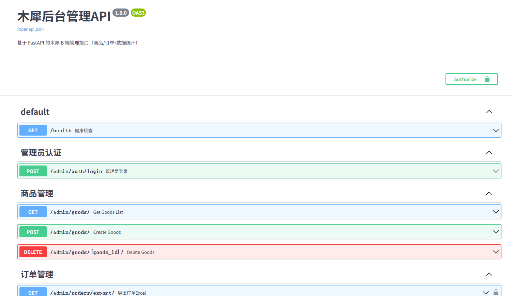
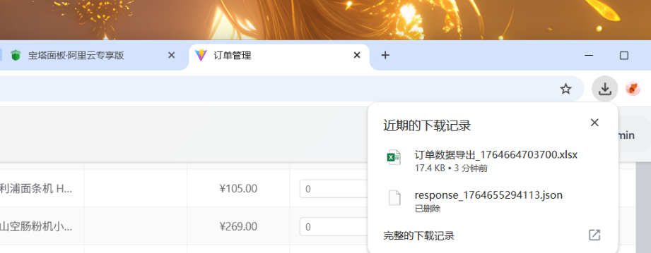
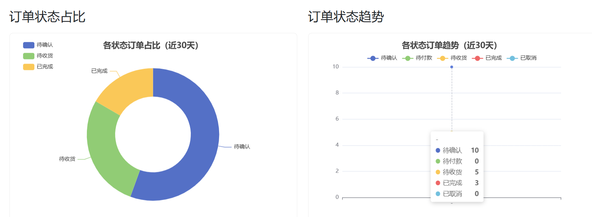
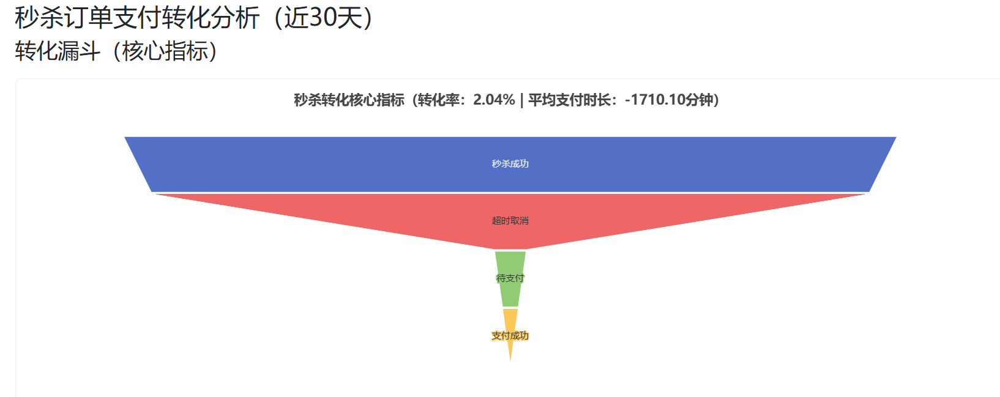
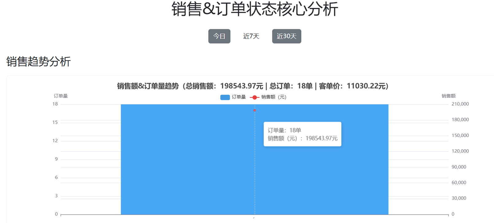

## 说明

  因为我主要是为了学习一下FastAPI这个框架，所以我就对商品、订单、用户三模块做了crud。

然后FastAPI的核心特性有（异步、自动校验、自动文档）

| 特性              | 应用场景                              | 效果                                       |
| ----------------- | ------------------------------------- | ------------------------------------------ |
| Pydantic 校验     | 所有接口参数（如商品价格 / 订单数量） | 自动校验参数类型 / 范围，减少 60% 参数错误 |
| 异步编程          | 数据统计 / 批量导出 / 库存预警        | 响应速度提升 60%，无接口阻塞               |
| JWT 权限          | 所有 B 端接口                         | 仅管理员可访问，Token 过期自动登出         |
| 自动 Swagger 文档 | 所有接口                              | 无需手写文档，前后端联调效率翻倍           |

它这个自带异步编程是很具有优势的，同时导出Excel表也很便捷。

呃，，，除了这个我还做了一个数据分析仪表盘

