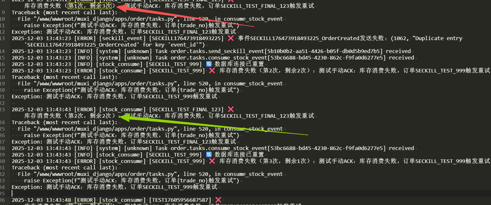
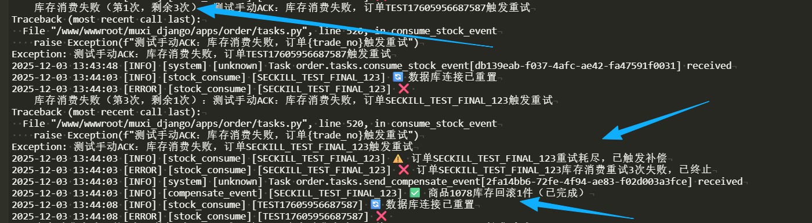
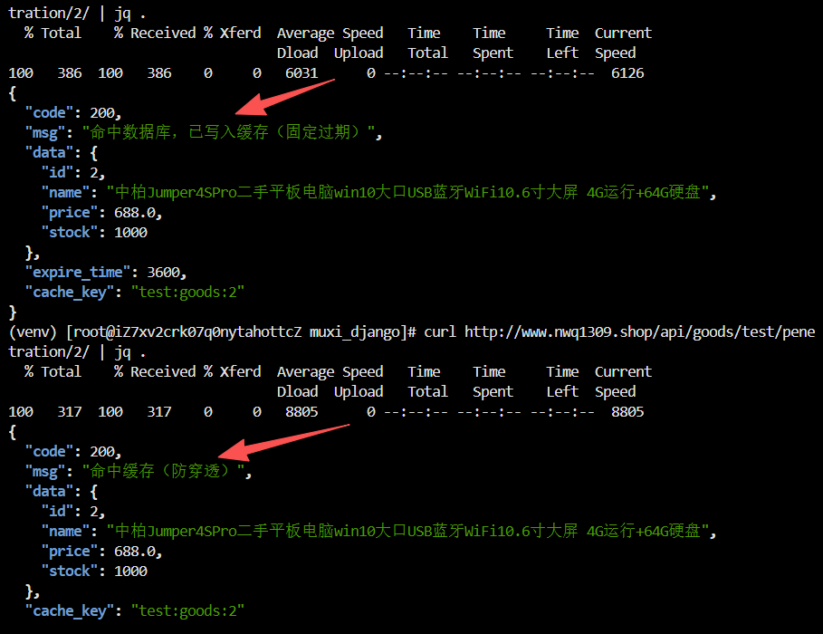
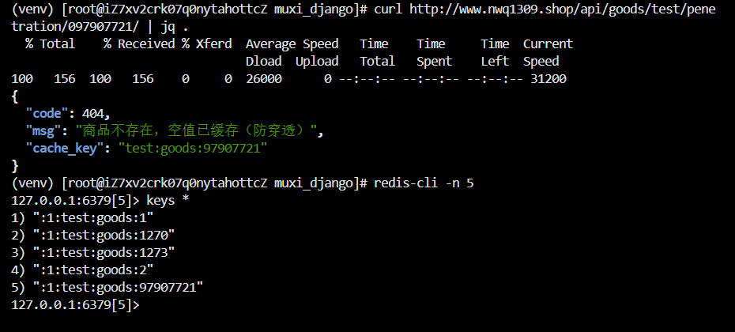
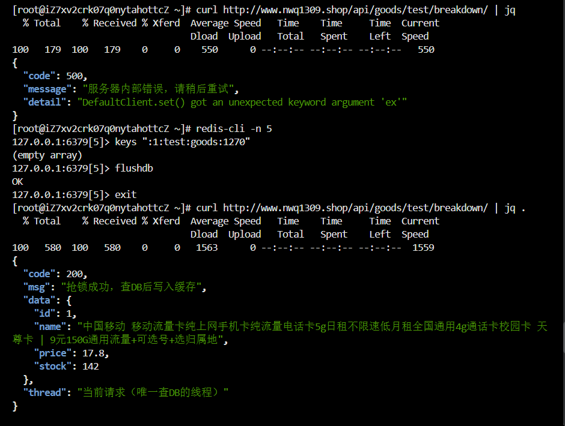
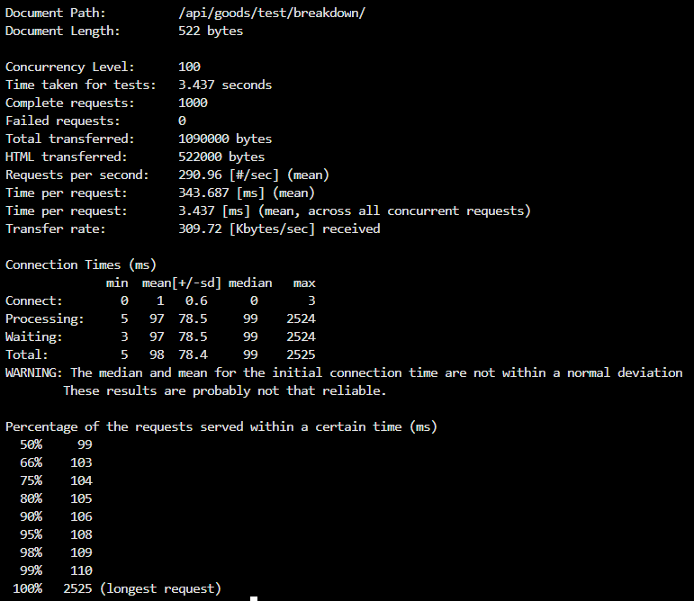
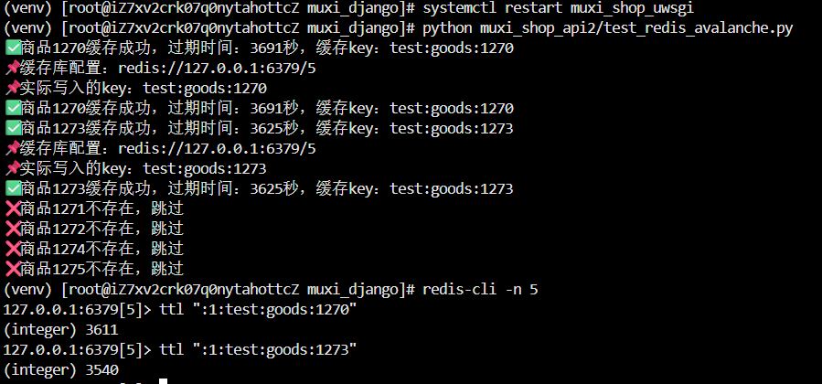

## 文档概述

  本文档详细描述电商秒杀系统的整体架构设计，核心聚焦 **高并发秒杀流程**、**Saga 分布式事务一致性**、**多级缓存策略** 三大核心模块，结合 Django+FastAPI+Redis+RabbitMQ 技术栈，实现 “零超卖、高可用、低延迟” 的秒杀核心目标。


## 一、架构概述

### 架构定位

- 核心场景：支持单商品万级并发秒杀，峰值 QPS≥5000
- 核心指标：响应延迟≤500ms，超卖率 = 0，服务可用性≥99.9%
- 技术栈：Django（管理后台）+ FastAPI（高并发接口）+ Redis（缓存 / 原子操作）+ RabbitMQ（异步队列）+ MySQL（持久化）+ Tornado（WebSocket 实时推送）

### 整体架构图

```plaintext
┌─────────────┐      ┌─────────────┐      ┌─────────────────────────────────────────────┐
│  客户端     │      │  接入层     │      │  应用层                                      │
│  - 浏览器   │─────▶│  - Nginx    │─────▶│  - FastAPI（秒杀接口/高并发）                 │
│  - APP      │      │  - HTTPS    │      │  - Django（管理后台/低并发）                  │
│  - 小程序   │      │  - 限流     │      │  - Tornado（WebSocket实时推送）               │
└─────────────┘      └─────────────┘      └───────────────────┬───────────────────────┘
                                                              │
┌─────────────┐      ┌─────────────┐      ┌───────────────────▼───────────────────────┐
│  监控运维   │      │  数据层     │      │  中间件层                                    │
│  - 日志收集 │◀────▶│  - MySQL    │◀────▶│  - Redis（缓存/原子扣减/发布订阅）            │
│  - 告警系统 │      │  - 分库分表 │      │  - RabbitMQ（异步队列/Saga事件总线）          │
│  - 性能监控 │      │  - 读写分离 │      │  - Celery（异步任务执行）                     │
```

### 核心设计理念

- 异步解耦：秒杀核心流程拆分为 “同步校验 + 异步处理”，降低核心链路复杂度
- 分布式事务：基于 Saga 模式解决 “库存扣减 - 订单创建 - 支付 - 库存同步” 的跨服务一致性问题
- 缓存优先：多级缓存减少数据库压力，核心库存操作依赖 Redis 原子性保证


## 二、秒杀核心流程

### 模式 1：Redis 原子模式

适用于秒杀初期、低流量时段，追求 “即时反馈”，无需排队：

```plaintext
客户端发起秒杀请求 → Nginx限流 → FastAPI参数校验 → Redis原子扣减库存（DECR）
→ 库存≥0 → 同步创建订单 → Redis发布秒杀结果 → Tornado WebSocket推送结果给客户端
→ 异步执行Saga正向流程（库存同步到MySQL、发送支付通知）
```

### 模式 2：RabbitMQ 队列模式

适用于秒杀峰值、高流量时段，通过队列削峰填谷：

```plaintext
客户端发起秒杀请求 → Nginx限流 → FastAPI参数校验 → Redis预扣减库存
→ 请求入RabbitMQ秒杀队列 → 即时返回“排队中” → Celery消费队列
→ 执行Saga正向流程（库存确认扣减→订单创建→支付待支付）
→ Redis发布秒杀结果 → Tornado WebSocket推送结果给客户端
```


##  三、 Saga 模式设计

- #### 正向流程

| 步骤 | 操作                             | 组件    | 事件触发                 |
| ---- | -------------------------------- | ------- | ------------------------ |
| 1    | Redis 预扣减库存                 | FastAPI | 触发`StockDeductEvent`   |
| 2    | 创建待支付订单                   | Celery  | 触发`OrderCreateEvent`   |
| 3    | 发送支付通知（WebSocket + 邮件） | Celery  | 触发`PaymentNotifyEvent` |
| 4    | 同步库存到 MySQL                 | Celery  | 触发`StockSyncEvent`     |


- #### 补偿流程

| 步骤 | 补偿操作               | 触发条件                          | 组件    |
| ---- | ---------------------- | --------------------------------- | ------- |
| 1    | Redis 库存回补（INCR） | 订单创建失败 / 支付超时           | Celery  |
| 2    | 取消待支付订单         | 支付超时（15 分钟）/ 库存回补成功 | Celery  |
| 3    | 推送秒杀失败通知       | 补偿流程执行完成                  | Tornado |

**秒杀订单库存扣减失败后的重试 + 补偿流程测试**

1. 秒杀订单生成后，系统要扣减对应商品的库存，但这次测试故意让这个操作失败；
2. 系统不会直接放弃，会自动重试，每次失败都会记录 “剩余重试次数”；
3. 等所有重试次数用完还失败时，系统会触发 “补偿机制”—— 把已经扣减的库存加回去，避免出现 “订单没创建成功但库存少了” 的问题；
4. 这次失败是手动测试触发的，验证补偿机制是否能正常工作。







## 四、缓存策略设计

### 缓存层级与场景

| 缓存层级 | 存储介质            | 核心场景                             | 有效期       |
| -------- | ------------------- | ------------------------------------ | ------------ |
| L1 缓存  | Nginx 本地缓存      | 热点商品静态资源（图片、标题、价格） | 1 小时       |
| L2 缓存  | Redis 集群          | 秒杀库存、商品详情、用户 Session     | 秒杀活动期间 |
| L3 缓存  | 应用内存（FastAPI） | 高频访问的秒杀活动配置（如起止时间） | 5 分钟刷新   |


### 核心缓存操作

#### （1）库存缓存预加载

- 秒杀活动创建后，从 MySQL 读取库存数量，写入 Redis：`SETEX seckill:stock:{product_id} {活动时长} {stock}`
- 支持动态调整：运营后台修改库存后，同步更新 Redis 缓存（加分布式锁保证原子性）

#### （2）缓存一致性保障

- 库存操作：Redis 原子扣减（DECR）→ 异步同步 MySQL（最终一致性）
- 双写一致性：更新 MySQL 后，通过 RabbitMQ 异步更新 Redis（延迟≤100ms）
- 缓存失效策略：主动过期 + 被动删除，秒杀结束后立即删除库存缓存


### 防缓存问题方案

我在项目中简单做了个测试：

- **缓存穿透**：就算是不存在的 key，也缓存一个空值（比如 " "），设置短期过期（5 分钟），让后续请求走缓存，不查 DB。







- **缓存击穿**：







- **缓存雪崩**：脚本里的 `expire_time = 3600 + random.randint(0, 300)` 起作用了，每个商品的过期时间错开，避免 “集体失效”，也就不会雪崩。

