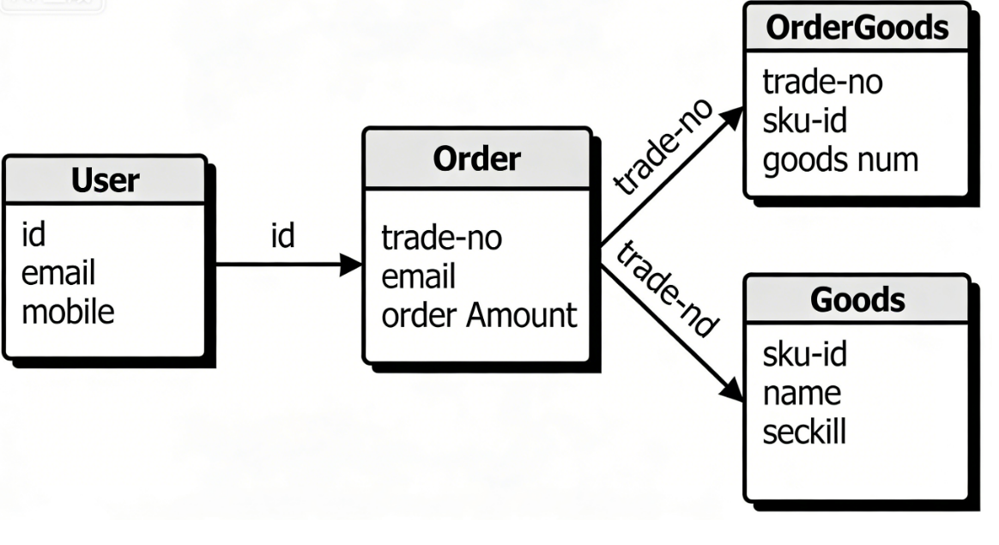

### 核心表结构（秒杀 / 订单 / 商品 / 用户）

#### 秒杀活动表

| 字段名        | 类型          | 说明                      | 备注 |
| ------------- | ------------- | ------------------------- | ---- |
| id            | int(11)       | 主键                      | 自增 |
| product_id    | int(11)       | 关联商品 ID               | 外键 |
| seckill_mode  | varchar(20)   | 秒杀模式（limited/timed） |      |
| stock         | int(11)       | 秒杀库存                  | 非空 |
| seckill_price | decimal(10,2) | 秒杀价格                  | 非空 |
| start_time    | datetime      | 开始时间                  | 非空 |
| end_time      | datetime      | 结束时间                  | 非空 |

#### 订单表

| 字段名       | 类型          | 说明              | 备注     |
| ------------ | ------------- | ----------------- | -------- |
| id           | int(11)       | 主键              | 自增     |
| trade_no     | varchar(64)   | 订单唯一编号      | 唯一索引 |
| user_id      | int(11)       | 关联用户 ID       | 外键     |
| order_amount | decimal(10,2) | 订单金额          | 非空     |
| pay_status   | varchar(10)   | 支付状态（0/1/2） |          |
| create_time  | datetime      | 创建时间          | 非空     |

#### 商品表

| 字段名     | 类型          | 说明         | 备注     |
| ---------- | ------------- | ------------ | -------- |
| id         | int(11)       | 主键         | 自增     |
| sku_id     | varchar(64)   | 商品 SKU     | 唯一索引 |
| name       | varchar(255)  | 商品名称     | 非空     |
| price      | decimal(10,2) | 原价         |          |
| is_seckill | tinyint(1)    | 是否秒杀商品 | 联合索引 |
| status     | tinyint(1)    | 上架状态     |          |

#### 用户表

| 字段名    | 类型        | 说明     | 备注     |
| --------- | ----------- | -------- | -------- |
| id        | int(11)     | 主键     | 自增     |
| mobile    | varchar(11) | 手机号   | 唯一索引 |
| email     | varchar(64) | 邮箱     | 唯一索引 |
| is_active | tinyint(1)  | 账号状态 |          |

- 注：做的是逻辑关联，而非数据库级别的物理外键 （避免外键锁影响性能）

