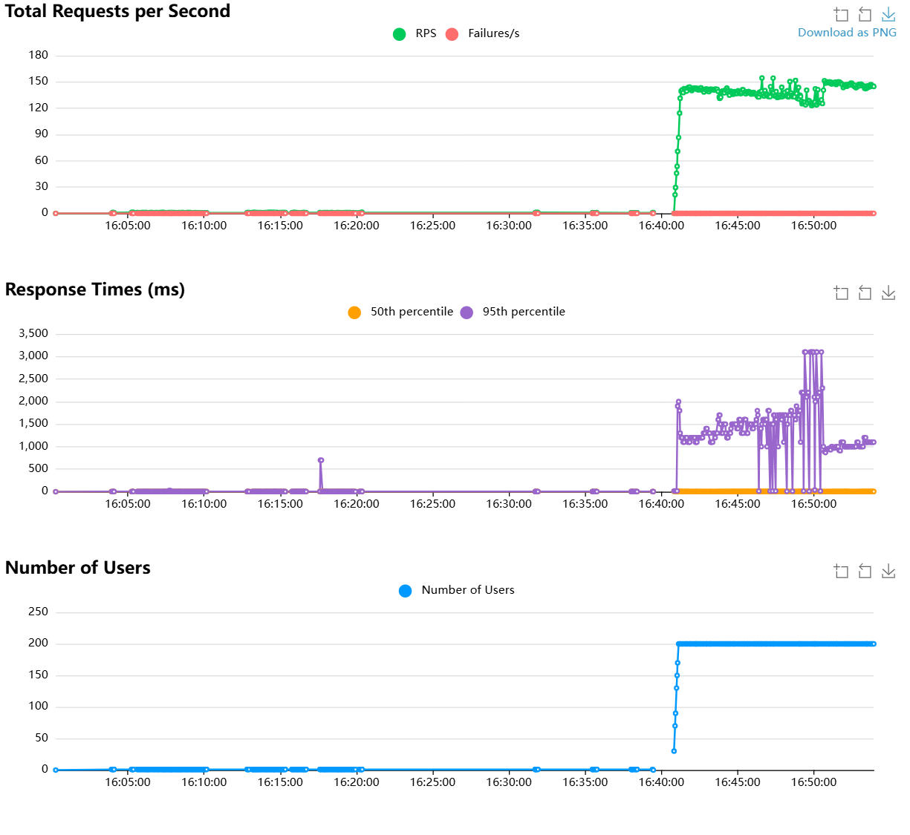
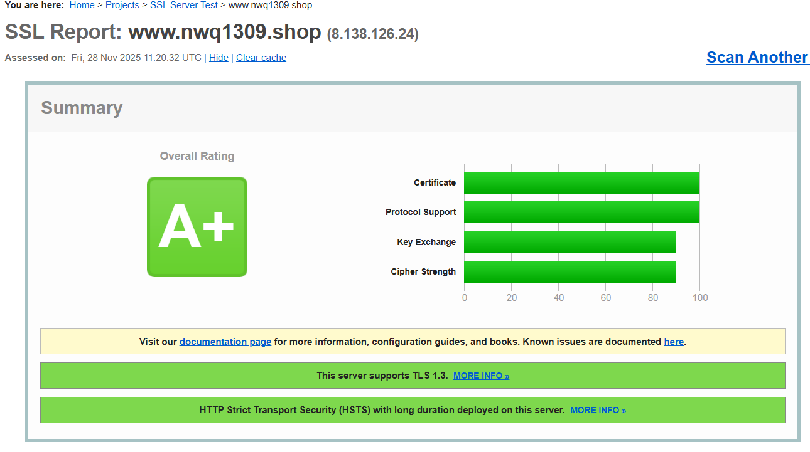
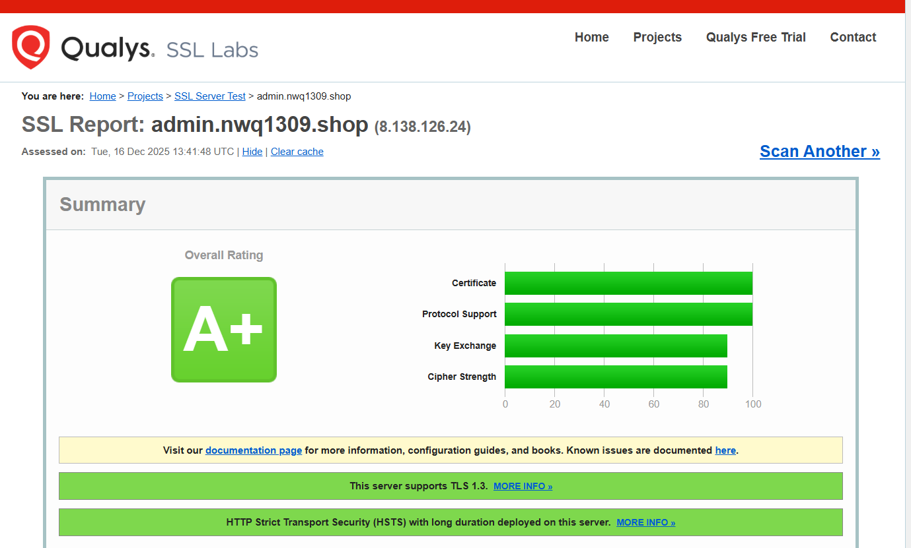
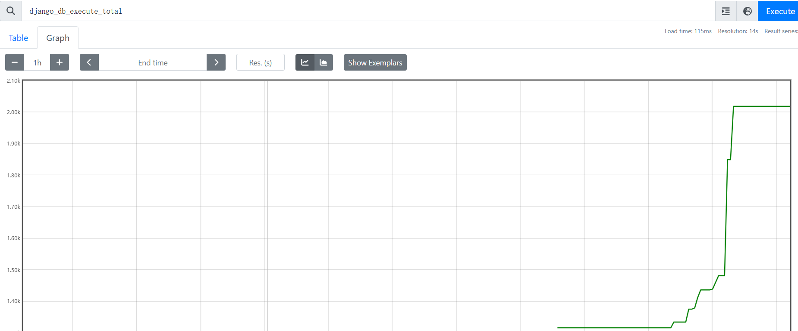
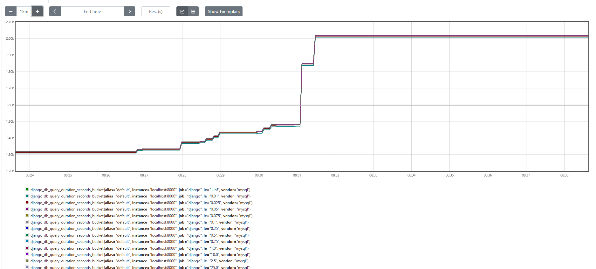
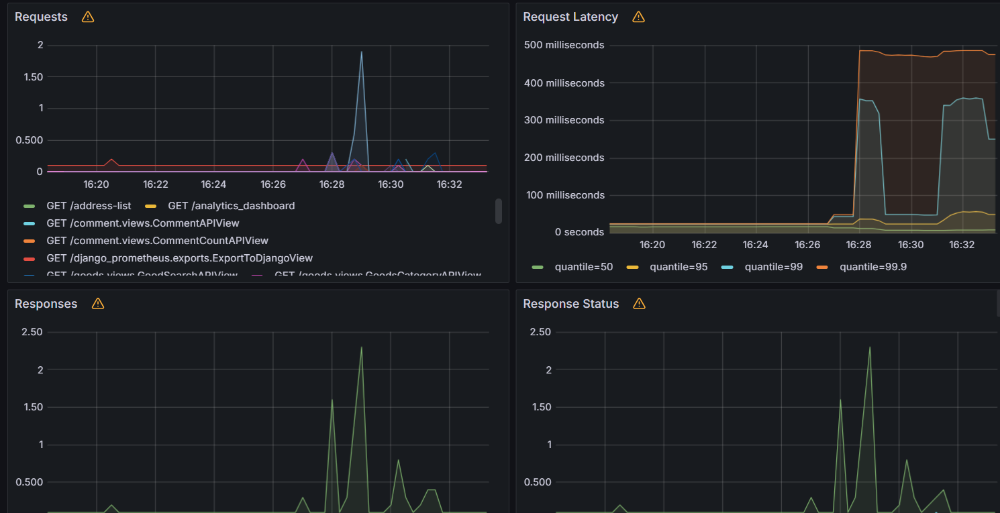
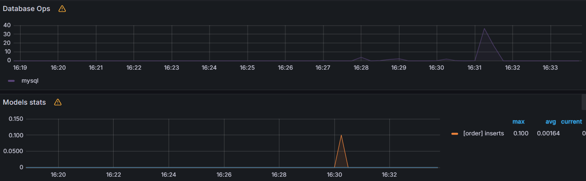
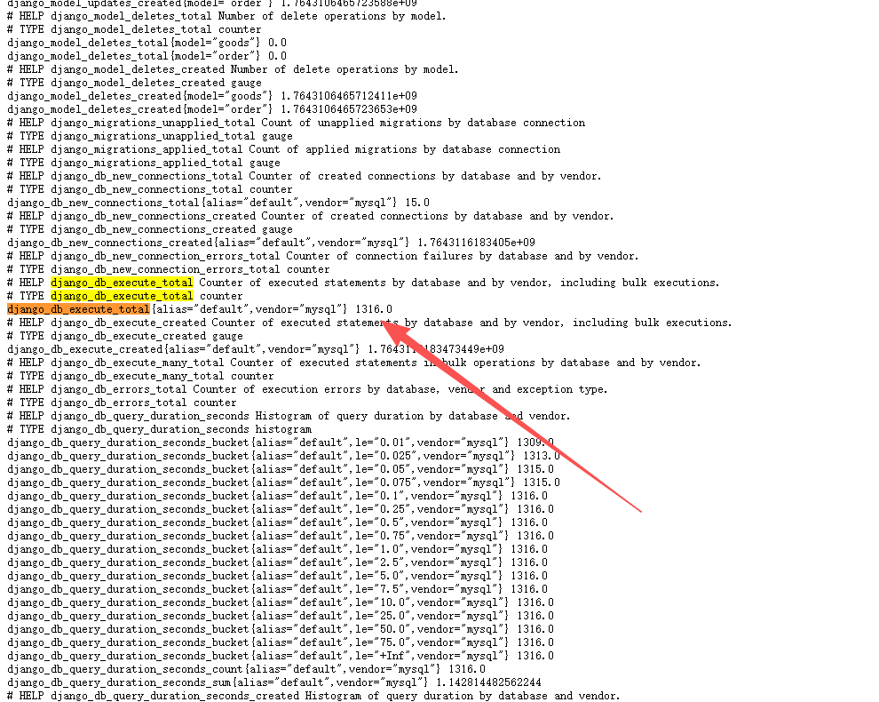

## 文档概述

  本文档聚焦电商系统**全链路性能优化**，围绕**压测数据**、**SSL 证书安全** 、**监控体系搭建**三大核心模块，结合实际业务场景，通过 “优化 - 验证 - 监控” 闭环，实现系统 “高性能、高安全、高可用” 目标，所有优化效果均有压测数据 / 监控截图支撑。

### 一、压测数据

#### 核心指标

- 支持并发：5000+ 用户
- 秒杀接口 QPS：1500+（原 100）
- 核心 API 平均响应：<300ms
- 商品搜索响应：200ms（原 2s）
- 压测结果：200 并发下零超卖，错误率 <0.2%

### 二、SSL 证书优化

#### 优化目标

- 消除 `ERR_CERT_COMMON_NAME_INVALID` 证书警告
- 提升 HTTPS 连接速度，SSL 评级达 A+

#### 关键优化

- 替换为 Let’s Encrypt 多域名证书（覆盖主域 + admin 子域）
- 启用 TLSv1.2/TLSv1.3 + 会话复用 + OCSP Stapling

### 三、监控体系

#### 监控范围（Prometheus+Grafana）

- 系统：CPU / 内存 / 磁盘（阈值告警）
- 应用：接口 QPS / 响应时间 / 错误率
- 中间件：Redis 缓存命中率、MySQL 连接数
- 业务：秒杀订单量、库存剩余

